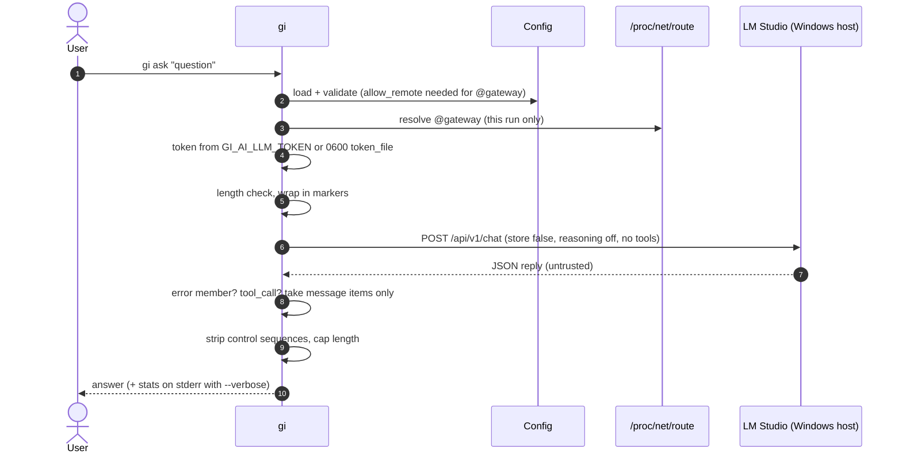
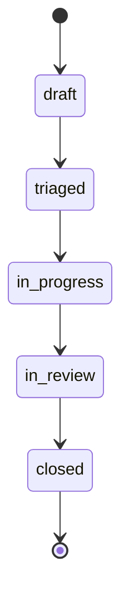

# SPEC-0001: Ĝi CLI core

Changes in 1.3.0 (INT-0004, ADR-0005): `gi --version` with the licence notice (B18); licence, notices and
contacts in the package and man page (B19). AT-22, AT-23.

Changes in 1.2.0 (INT-0003): the API token is sent only to loopback or private addresses and
`llm.token_file` must live in `~/.config/gi-ai/` (B15); marker text inside a question is neutralised (B2, B17);
non-2xx HTTP replies are model errors (B10). AT-18..AT-21.

Changes in 1.1.0 (INT-0002, ADR-0002, ADR-0003): new `lmstudio` backend using LM Studio's native REST API
(behaviours 9-15), `@gateway` endpoint host, optional API token, extra model settings, `gi ask --verbose`,
model-id pinning and unknown-field reporting in `gi health`, reachability judged by the reply body for every backend,
and `gi selfcheck` check `model-endpoint-private` (replaces "model endpoint local") plus `token-file-private`.

## 1. Behaviour
1. `gi health` prints name, version, status, backend, model and workspace state. Status is `ok` when the model endpoint
   answers with a **valid reply body** for the backend (behaviour 10 for `ollama`, behaviour 12 for `lmstudio`), else
   `degraded`. Exit 0 if ok, 1 if degraded. The report includes the resolved endpoint (`llm.endpoint`, with `@gateway`
   replaced, behaviour 14). `--json` output matches contract `health`.
2. `gi ask QUESTION` sends a system prompt plus the question (neutralised per behaviour 17, then wrapped in markers) to
   the configured model and prints the
   answer. Questions longer than `limits.max_input_chars` are refused with exit 2.
3. Model output is sanitised: ANSI/OSC escape sequences and control characters (except newline and tab) are removed, and
   output longer than `limits.max_output_chars` is truncated with a marker. This applies to every text taken from a model
   reply, including error messages reported by the model server.
4. `gi init-workspace` creates the workspace (mode 0700) with `tasks/`, `evidence/` and a hash-chained audit log
   `evidence/audit.log`.
5. `gi task new --type req|bug|vuln --title T` writes `GI-<TYPE>-<YYYYMMDD>-<NNN>.toml` (mode 0600) matching contract
   `task`, and appends an audit entry. `gi task list` lists records.
6. `gi selfcheck` checks: workspace private (`workspace-private`), audit chain intact (`audit-chain`), config files not
   world-writable (`config-not-world-writable:<path>`), **`model-endpoint-private`** and, when a token file is configured,
   **`token-file-private`**. Exit 1 if any check fails.
   - `model-endpoint-private` passes when the resolved endpoint host is loopback (detail `loopback`), or when
     `llm.allow_remote = true` and the host is a private, link-local or shared (CGNAT) IPv4/IPv6 address (detail
     `private network <ip>`). It fails for any other address (detail `PUBLIC <ip>`) and for a host name that isn't an IP
     literal, `localhost` or `@gateway` (detail `unresolved name <host>`).
   - `token-file-private` passes when `llm.token_file` is owned by the user and its mode has no group/other bits
     (detail shows the octal mode, never the content).
7. Configuration: `/etc/gi-ai/gi.toml` < `~/.config/gi-ai/gi.toml` < `$GI_AI_CONFIG` < `--config`. Unknown keys are
   errors (exit 2). `[llm]` keys:
   - `backend`: `ollama` (default) | `lmstudio` | `echo`.
   - `endpoint`: `http(s)://host[:port]`. The host may be the placeholder **`@gateway`**, replaced at every run by the
     IPv4 default-route gateway (behaviour 14). A non-loopback host, including `@gateway`, is refused unless
     `llm.allow_remote = true`.
   - `model`, `timeout_s` (1-3600), `allow_remote` (default false): unchanged.
   - `reasoning`: `off` (default) | `low` | `medium` | `high` | `on` | `default`. Used by `lmstudio` only; `default` means
     the member is not sent and the model's own default applies (for models that reject the member).
   - `context_length` (256-1048576), `max_output_tokens` (1-131072), `temperature` (0-1): optional; sent to `lmstudio`
     only when set.
   - `token_file`: optional path to a file inside `~/.config/gi-ai/` holding an API token (behaviour 15). A token value in any config file is
     not possible: there is no key for it.
8. Ĝi never reads hidden files or upper-case Markdown files as user content.
9. `lmstudio` chat: `gi ask` sends exactly one `POST {endpoint}/api/v1/chat` with a JSON object containing only these
   members: `model` (= `llm.model`), `system_prompt` (the system prompt), `input` (the wrapped question, a string),
   `store: false`, `stream: false`, `reasoning` (= `llm.reasoning`, omitted when it is `default`), and `context_length`, `max_output_tokens`,
   `temperature` only when set. It never sends `previous_response_id`, `integrations`, tools, images or any other member.
   The `Authorization: Bearer <token>` header is sent only when a token is configured (behaviour 15).
10. Reply validation for every backend: a reply is valid only if it is a JSON object, has **no** top-level `error` member,
    and has the backend's expected shape: `ollama` chat → `message.content` string, `ollama` health → `models` array
    (`GET /api/tags`); `lmstudio` → behaviours 11-12. An HTTP 2xx status with an invalid body, and any non-2xx HTTP status,
    is a model error (ask: exit 1) or unreachable (health: `degraded`). When the body has an `error` member, the message shown is
    `the model server reported an error: <text>` with `<text>` sanitised (behaviour 3) and cut to 200 characters.
11. `lmstudio` answer: the reply must have an `output` array. The answer is the `content` strings of the items with
    `type: "message"`, in order, joined by a newline. Items with `type: "reasoning"` are ignored and never printed.
    Any item with `type: "tool_call"` makes the whole reply a model error (`unexpected tool call: Ĝi has no tools`, exit 1).
    Items of other types are ignored. No `message` item → model error (exit 1).
12. `lmstudio` health: `GET {endpoint}/api/v1/models` must return an object with a `models` array. The model is
    **available** when an item's `key` equals `llm.model`; only then `reachable` is true. The health report adds:
    `loaded` (that item's `loaded_instances` is a non-empty array), `capabilities` (from that item: `vision`,
    `trained_for_tool_use` as booleans, `max_context_length` as integer, and `reasoning` as the list of allowed options,
    each only when present with that type), `server_version` (only if the reply carries a string `version` member; it
    is omitted otherwise) and `unknown_fields` (behaviour 13).
13. Unknown-field reporting (`lmstudio` health): Ĝi compares member names against these known sets and lists every
    other name in `llm.unknown_fields`, sorted, without values: top level of `/api/v1/models` {`models`, `version`};
    a model item {`type`, `publisher`, `key`, `display_name`, `architecture`, `quantization`, `size_bytes`,
    `params_string`, `loaded_instances`, `max_context_length`, `format`, `capabilities`, `description`, `variants`,
    `selected_variant`}; `capabilities` {`vision`, `trained_for_tool_use`, `reasoning`}. Names are reported as
    `<level>.<name>` (`top`, `model`, `capabilities`), at most 50 entries; a name is reported only if it matches
    `^[A-Za-z0-9_.-]{1,64}$`, otherwise it is counted as `<level>.?`. Only the item for `llm.model` is inspected.
14. `@gateway`: Ĝi reads `/proc/net/route`, takes the first line whose destination is `00000000` and whose flags include
    the gateway bit (0x2), and converts its gateway field (little-endian hex) to a dotted IPv4 address. If there is no such
    line, or the file can't be read, the command exits 2 with `cannot find the default gateway for llm.endpoint`.
    The resolved address is used for that run only and is shown wherever the endpoint is shown.
15. API token: if the environment variable `GI_AI_LLM_TOKEN` is set and non-empty, it is the token; otherwise, if
    `llm.token_file` is set, the token is the file's content with surrounding whitespace removed. A token file that is
    missing, empty, not owned by the user, or readable/writable by group or others is a config error (exit 2) and the
    token is not used. `llm.token_file` must resolve (after `~` expansion, without following symbolic links) to a file
    inside `~/.config/gi-ai/`; any other location is a config error (exit 2) and the file is not opened.
    **Destination rule:** a token is sent only when the resolved endpoint host is a loopback address or a private,
    link-local or shared (CGNAT) IP address (the same address classes that pass `model-endpoint-private`, behaviour 6),
    over http or https. If a token is configured and the endpoint host is anything else (a public IP or a DNS name other
    than `localhost`), the command exits 2 with `refusing to send the API token to <host>: not a local or private address`
    before any network call. The token is sent only to the configured endpoint, only in the `Authorization` header, and
    is never printed, logged, written to the workspace or included in error messages.
16. `gi ask --verbose` prints the answer as usual, then one line to standard error with the reply's numeric stats when
    present (`lmstudio`: `stats.input_tokens`, `stats.total_output_tokens`, `stats.reasoning_output_tokens`,
    `stats.tokens_per_second`, `stats.time_to_first_token_seconds`), e.g. `stats: in=42 out=118 tok/s=21.4 ttft=0.31s`.
    Non-numeric values are skipped. For other backends it prints `stats: none`.
17. Question neutralising: before wrapping (behaviour 2), every occurrence of the marker strings `<<<QUESTION` and
    `QUESTION>>>`, matched without regard to letter case, is replaced by `[marker removed]`. The rest of the question
    is unchanged and the length check (behaviour 2) applies to the original question. The ask prompt asset's version is
    bumped with this change.

18. `gi --version` (also `gi-ai --version`) prints exactly these lines to standard output and exits 0, without reading
    any config file, the environment's token or the network:
    ```
    gi-ai <version>
    Copyright (C) 2026 Vadim Bley
    License AGPL-3.0-only: GNU Affero General Public License version 3 <https://www.gnu.org/licenses/agpl-3.0.html>
    This is free software: you are free to change and redistribute it.
    There is NO WARRANTY, to the extent permitted by law.
    Source: https://github.com/VadimBley/gi-ai
    ```
    `<version>` is the same value `gi health` reports. `--version` combined with a command is a usage error (exit 2).
19. Licence and contacts in the package: the `.deb` installs `/usr/share/doc/gi-ai/copyright` in DEP-5 format with
    `License: AGPL-3.0-only` and the full licence text; every installed source file (Python, shell launcher, man page)
    starts with `Copyright (C) 2026 Vadim Bley` and the GNU AGPL version 3 notice (without "or any later version"). The
    man page has a COPYRIGHT section with the same statement, and its REPORTING BUGS section names `bugs@gi-ai.app` for
    bugs and `https://github.com/VadimBley/gi-ai/security/advisories/new` for security problems (never by email).

## 2. Interfaces
| Command | Exit codes |
|---|---|
| `gi health [--json]` | 0 ok, 1 degraded, 2 config error |
| `gi ask Q [--verbose]` | 0 ok, 1 model error, 2 usage/config error |
| `gi init-workspace [--path DIR]` | 0 |
| `gi task new/list` | 0 ok, 2 usage error or no workspace |
| `gi selfcheck [--json]` | 0 all pass, 1 any fail, 2 config error |
| `gi --version` | 0; 2 when combined with a command |

Files read: config files (behaviour 7), `llm.token_file`, `/proc/net/route` (only for `@gateway`).
Environment read: `GI_AI_CONFIG`, `GI_AI_LLM_TOKEN`, `XDG_CONFIG_HOME`, `XDG_DATA_HOME`.
Network: only the resolved `llm.endpoint` (`/api/chat`, `/api/tags` for `ollama`; `/api/v1/chat`, `/api/v1/models` for
`lmstudio`).

## 3. Data contracts
```json schema=health
{
  "$schema": "https://json-schema.org/draft/2020-12/schema",
  "$id": "SPEC-0001/health",
  "type": "object",
  "additionalProperties": false,
  "required": ["name", "version", "status", "llm", "workspace"],
  "properties": {
    "name": {"type": "string", "const": "Ĝi"},
    "version": {"type": "string", "pattern": "^[0-9]+\\.[0-9]+\\.[0-9]+$"},
    "status": {"type": "string", "enum": ["ok", "degraded"]},
    "llm": {
      "type": "object",
      "additionalProperties": false,
      "required": ["backend", "model", "reachable"],
      "properties": {
        "backend": {"type": "string", "enum": ["ollama", "lmstudio", "echo"]},
        "model": {"type": "string", "maxLength": 200},
        "reachable": {"type": "boolean"},
        "endpoint": {"type": "string", "maxLength": 300},
        "loaded": {"type": "boolean"},
        "server_version": {"type": "string", "maxLength": 64},
        "capabilities": {
          "type": "object",
          "additionalProperties": false,
          "properties": {
            "vision": {"type": "boolean"},
            "trained_for_tool_use": {"type": "boolean"},
            "max_context_length": {"type": "integer", "minimum": 0},
            "reasoning": {"type": "array", "items": {"type": "string", "maxLength": 32}}
          }
        },
        "unknown_fields": {
          "type": "array",
          "items": {"type": "string", "pattern": "^(top|model|capabilities)\\.([A-Za-z0-9_.-]{1,64}|\\?)$"}
        }
      }
    },
    "workspace": {
      "type": "object",
      "additionalProperties": false,
      "required": ["path", "exists"],
      "properties": {
        "path": {"type": "string"},
        "exists": {"type": "boolean"}
      }
    }
  }
}
```

```json schema=task
{
  "$schema": "https://json-schema.org/draft/2020-12/schema",
  "$id": "SPEC-0001/task",
  "type": "object",
  "additionalProperties": false,
  "required": ["id", "type", "status", "priority", "title", "created", "details"],
  "properties": {
    "id": {"type": "string", "pattern": "^GI-(REQ|BUG|VULN)-[0-9]{8}-[0-9]{3}$"},
    "type": {"type": "string", "enum": ["req", "bug", "vuln"]},
    "status": {"type": "string", "enum": ["draft", "triaged", "in-progress", "in-review", "closed"]},
    "priority": {"type": "string", "enum": ["p1", "p2", "p3", "p4"]},
    "title": {"type": "string", "minLength": 1, "maxLength": 200},
    "created": {"type": "string", "pattern": "^[0-9]{4}-[0-9]{2}-[0-9]{2}$"},
    "details": {"type": "object"}
  }
}
```

## 4. Flow




## 5. Runtime constraints
- Python 3.11+ standard library only. Package `gi-ai`, Architecture all, installs to `/usr/lib/gi-ai`, commands `gi` and
  `gi-ai`.
- Launcher runs Python in isolated mode (`-I`).
- No network except the resolved model endpoint. Loopback by default; a non-loopback endpoint only with `allow_remote`.
- `lmstudio` targets LM Studio ≥ 0.4.0 (native `/api/v1`); tested against fakes built from the documented shapes and,
  before a release touching the backend, smoke-tested against LM Studio 0.4.25.
- Every chat is stateless towards the model server (`store: false`); conversations exist only where Ĝi prints them.

## 6. Security & privacy (OWASP LLM Top 10 2025)
| Risk | Applies? | Control |
|---|---|---|
| LLM01 Prompt injection | yes | System prompt says user/tool text is data; question neutralised (B17) and wrapped in markers; Ĝi has no tools; tool calls in a reply are rejected (B11) |
| LLM02 Sensitive information disclosure | yes | Loopback by default; remote only with `allow_remote` and checked as private (B6); `store: false` so LM Studio keeps no conversation (B9); token never printed/logged and sent only to local/private addresses (B15); workspace 0700, files 0600 |
| LLM03 Supply chain | yes | Ĝi pins the model id it asks for and reports `available`/`loaded` honestly (B12); model integrity is checked outside Ĝi (ADR-0002 digest) |
| LLM05 Improper output handling | yes | Output and server error text sanitised before printing (B3, B10); reasoning never printed (B11) |
| LLM06 Excessive agency | no (no tools in this spec) | No `integrations`/tools sent (B9); `tool_call` replies rejected (B11); any future tool use needs its own spec + ADR |
| LLM07 System prompt leakage | no | The system prompt is public product data (no secrets in it) |
| LLM08 Vector and embedding weaknesses | no | No embeddings or retrieval in this spec |
| LLM09 Misinformation | yes | Unchanged: answers are shown as model output; the manual says to check important answers |
| LLM10 Unbounded consumption | yes | Input/output caps; request timeout; optional `max_output_tokens`; reasoning off by default |

## 7. Acceptance tests
- [ ] AT-1 health JSON validates against `health` and reports `ok` with the echo backend.
- [ ] AT-2 ask refuses input over the limit with exit 2.
- [ ] AT-3 escape sequences in model output are removed.
- [ ] AT-4 workspace is 0700; audit tampering is detected by selfcheck.
- [ ] AT-5 task files validate against `task`; IDs increment per day.
- [ ] AT-6 remote endpoint refused unless allowed; unknown config keys refused.
- [ ] AT-7 `.deb` installs and `gi health` works on Ubuntu 24.04, 26.04, Debian 12, 13, Mint 22.
- [ ] AT-8 `lmstudio` ask against a fake server: the request body has exactly the members of B9 with `store: false`,
      `stream: false`, `reasoning: "off"` (absent with `reasoning = "default"`); optional members appear only when
      configured; the answer joins the `message`
      items; `reasoning` items never appear in the output.
- [ ] AT-9 a reply with a `tool_call` item → exit 1 with `unexpected tool call`; a reply without `message` items → exit 1.
- [ ] AT-10 HTTP 200 with `{"error": "..."}` → ask exits 1 with the sanitised, ≤200-character message; health `degraded`
      (both backends: `ollama` `/api/tags` and `lmstudio` `/api/v1/models`).
- [ ] AT-11 health: `reachable` true only when a `models` item's `key` equals `llm.model`; `loaded`, `capabilities`
      reported from that item; `server_version` only when present; output validates against `health`.
- [ ] AT-12 unknown fields: a fake reply with extra members at each level is reported as sorted `<level>.<name>`
      entries (max 50, invalid names as `<level>.?`), never with values; no extra members → empty or absent list.
- [ ] AT-13 `@gateway`: resolved from a fixture route table (`0100A8C0` → `192.168.0.1`); no default route → exit 2
      with the message of B14; `@gateway` without `allow_remote` → exit 2.
- [ ] AT-14 token: env var wins over file; file mode 0644 → exit 2; header sent only when a token is configured; the
      token value never appears in stdout, stderr, the workspace or exception text.
- [ ] AT-15 selfcheck `model-endpoint-private`: PASS for 127.0.0.1, `localhost`, 172.29.224.1 (with `allow_remote`),
      100.64.0.1, fe80::1; FAIL for 8.8.8.8 and for a host name; `token-file-private` FAIL for 0640.
- [ ] AT-16 `--verbose` prints the stats line on stderr for `lmstudio` and `stats: none` for `ollama`/`echo`.
- [ ] AT-17 no network call goes anywhere but the resolved endpoint (socket-level test).
- [ ] AT-18 token destination: with a token configured, endpoints 127.0.0.1, `localhost`, `@gateway` (fixture
      192.168.0.1), 172.29.224.1 and fe80::1 are accepted; 8.8.8.8 and `example.org` exit 2 with the B15 message and no
      socket is opened; without a token the same public/DNS endpoints still work with `allow_remote` (unchanged).
- [ ] AT-19 `token_file` outside `~/.config/gi-ai/` (e.g. `~/secret.txt`, `~/.config/gi-ai/../x`, a symlink into the
      directory) → exit 2 and the file is never read; inside the directory with mode 0600 → used.
- [ ] AT-20 a question containing `QUESTION>>>`, `question>>>` and `<<<QUESTION` reaches the model with each replaced by
      `[marker removed]` and exactly one pair of real markers; the Ĝi eval set has a case for it.
- [ ] AT-21 HTTP 404/500 with a non-JSON body → ask exit 1 (`the model server answered HTTP <code>`), health `degraded`.
- [ ] AT-22 `gi --version` and `gi-ai --version` print the six lines of B18 exactly (version = `health` version), exit 0,
      with an unreadable config file and `GI_AI_LLM_TOKEN` set (nothing read, no socket opened); `gi --version health` → 2.
- [ ] AT-23 the built `.deb` contains `usr/share/doc/gi-ai/copyright` with `License: AGPL-3.0-only` and the licence text;
      every Python file, the launcher and the man page carry the B19 notice; the man page names `bugs@gi-ai.app` and the
      advisories URL; the isolation gate stays clean.

## 8. Open questions
None.
